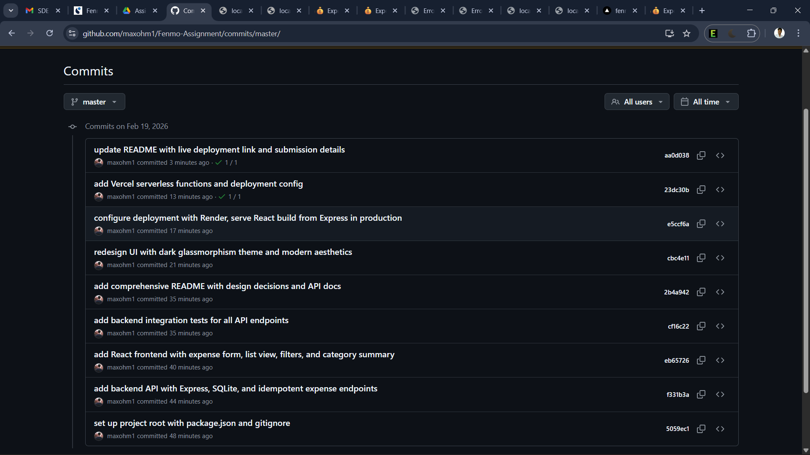

# 💰 Fenmo Expense Tracker

A simple, beautiful way to track your personal expenses. Built with a focus on clean design and reliable data handling.

[](https://fenmo-assignment-opal.vercel.app)

---

## Features

- **📝 Track Expenses**: Easily add new expenses with amount, category, and date.
- **🎨 Modern UI**: professional dark theme with glassmorphism effects.
- **📊 Insights**: See your total spending and a breakdown by category.
- **🔎 Filter & Sort**: Quickly find expenses by category or sort by date.
- **🛡️ Secure**: Prevents duplicate submissions even if you click twice.

## Tech Stack

- **Frontend**: React, Vite
- **Backend**: Node.js, Express
- **Database**: SQLite (Local) / In-Memory (Vercel Demo)
- **Styling**: Native CSS Variables

## Architecture

The project is a monorepo structure:

```
fenmo/
├── api/                 # Vercel serverless functions (Production)
├── server/              # Express.js backend (Local Development)
├── client/              # React + Vite frontend
├── vercel.json          # Deployment configuration
└── package.json         # Root scripts
```

- **Frontend**: Handles UI, state, and API calls.
- **Backend (Local)**: Uses SQLite for a persistent file-based database.
- **Backend (Prod)**: Uses Vercel Serverless Functions with an in-memory store for the demo.

---

## 🚀 Getting Started

To run this project locally:

1. **Clone the repo**
   ```bash
   git clone https://github.com/maxohm1/Fenmo-Assignment.git
   cd Fenmo-Assignment
   ```

2. **Install dependencies**
   ```bash
   npm run install:all
   ```

3. **Start the app**
   ```bash
   npm run dev
   ```
   - Frontend: `http://localhost:5173`
   - Backend: `http://localhost:3001`

---

## 📸 Submission Details

| Item | Link |
|------|------|
| **Live Application** | [https://fenmo-assignment-opal.vercel.app](https://fenmo-assignment-opal.vercel.app) |
| **GitHub Repository** | [https://github.com/maxohm1/Fenmo-Assignment](https://github.com/maxohm1/Fenmo-Assignment) |
| **Commit History** | [View Commits](https://github.com/maxohm1/Fenmo-Assignment/commits/master) |

### Commit History Screenshot


